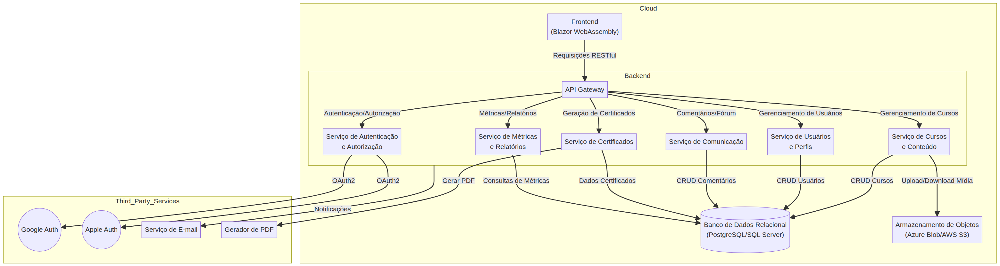

# Arquitetura do Sistema - Vulkanos Academy

## 1. Visão Geral

A plataforma Vulkanos Academy será um Sistema de Gestão de Aprendizagem (LMS) moderno, escalável e de alto desempenho, desenvolvido com **C# .NET 10** para o backend e **Blazor (WebAssembly)** para o frontend. A arquitetura será baseada em microsserviços ou em uma arquitetura em camadas bem definida, visando modularidade, escalabilidade e facilidade de manutenção. A comunicação entre os componentes será predominantemente via APIs RESTful.

## 2. Componentes Principais

### 2.1. Frontend (Blazor WebAssembly)

O frontend será desenvolvido utilizando Blazor WebAssembly, permitindo uma experiência de usuário rica e interativa diretamente no navegador. Ele se comunicará com o backend através de APIs RESTful seguras.

**Funcionalidades:**
*   **Autenticação e Autorização:** Interface para login via e-mail/senha, Google e Apple. Gerenciamento de perfil e assinaturas.
*   **Área do Aluno:** Dashboard, player de vídeo customizado, acesso a materiais complementares, fórum de dúvidas, visualização de progresso e certificados.
*   **Área do Produtor/Administrador:** Dashboards de métricas, gerenciamento de cursos (upload de vídeos, criação de módulos/aulas), moderação de comentários.

### 2.2. Backend (.NET 10 - API RESTful)

O backend será construído com .NET 10, expondo APIs RESTful para o frontend e outros serviços. Será responsável pela lógica de negócios, persistência de dados, autenticação e integração com serviços externos.

**Componentes Chave:**
*   **API Gateway:** Ponto de entrada unificado para todas as requisições do frontend, responsável por roteamento, segurança e balanceamento de carga.
*   **Serviço de Autenticação e Autorização:** Gerenciamento de usuários, roles (Aluno, Produtor, Administrador), tokens JWT, integração com provedores externos (Google, Apple).
*   **Serviço de Cursos e Conteúdo:** Gerenciamento de cursos, módulos, aulas, vídeos, materiais complementares. Armazenamento de arquivos.
*   **Serviço de Usuários e Perfis:** Gerenciamento de dados de usuário, assinaturas, progresso de aprendizado.
*   **Serviço de Comunicação:** Gerenciamento de comentários, fóruns e notificações.
*   **Serviço de Certificados:** Geração de certificados em PDF.
*   **Serviço de Métricas e Relatórios:** Coleta e processamento de dados para dashboards de Produtor/Admin.

### 2.3. Banco de Dados

Será utilizado um banco de dados relacional (ex: PostgreSQL ou SQL Server) para armazenar dados estruturados como informações de usuários, cursos, progresso, comentários, etc. Para arquivos de mídia (vídeos, PDFs), será utilizado um serviço de armazenamento de objetos (ex: Azure Blob Storage, AWS S3).

### 2.4. Serviços de Terceiros

*   **Provedores de Autenticação Social:** Google, Apple.
*   **Serviço de Armazenamento de Objetos:** Para vídeos e materiais complementares (ex: Azure Blob Storage, AWS S3).
*   **Serviço de E-mail:** Para notificações e recuperação de senha.
*   **Serviço de Geração de PDF:** Para certificados (pode ser uma biblioteca interna ou um serviço externo).

## 3. Fluxo de Comunicação

1.  O usuário acessa o frontend Blazor no navegador.
2.  O frontend se comunica com o Backend .NET 10 via API Gateway.
3.  O API Gateway roteia as requisições para os microsserviços apropriados.
4.  Os microsserviços interagem com o banco de dados relacional e/ou o serviço de armazenamento de objetos.
5.  Para autenticação social, o serviço de autenticação do backend interage com os provedores externos (Google, Apple).
6.  Para geração de certificados, o serviço de certificados interage com a biblioteca/serviço de PDF.

## 4. Considerações de Escalabilidade e Desempenho

*   **Microsserviços:** Permite escalar componentes individualmente.
*   **Cache:** Implementação de cache em níveis apropriados (CDN para assets estáticos, cache de dados no backend).
*   **Filas de Mensagens:** Para operações assíncronas (ex: processamento de vídeo, geração de certificados).
*   **Balanceamento de Carga:** Distribuição de tráfego entre instâncias do backend.
*   **Otimização de Banco de Dados:** Índices, queries otimizadas, possível uso de réplicas de leitura.

## 5. Diagrama de Arquitetura (Será gerado na fase 5)

