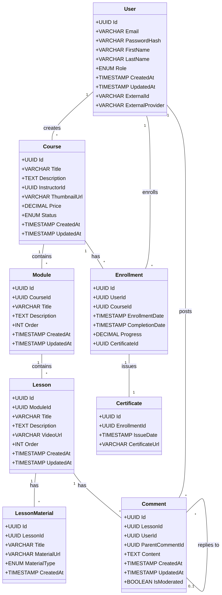

# Modelagem do Banco de Dados - Vulkanos Academy

## 1. Visão Geral

O banco de dados relacional será o coração da plataforma Vulkanos Academy, armazenando todas as informações estruturadas necessárias para o funcionamento do LMS. A modelagem visa garantir a integridade dos dados, escalabilidade e performance para as operações de leitura e escrita. Será utilizado um banco de dados como PostgreSQL ou SQL Server.

## 2. Entidades e Relacionamentos (ERD)

A seguir, são apresentadas as principais entidades e seus atributos, bem como os relacionamentos entre elas. O diagrama ERD será gerado na fase 5.

### 2.1. Tabela `Users`

Armazena informações sobre todos os usuários da plataforma (Alunos, Produtores, Administradores).

| Campo          | Tipo de Dados     | Restrições        | Descrição                                    |
| :------------- | :---------------- | :---------------- | :------------------------------------------- |
| `Id`           | `UUID`            | `PK`, `NOT NULL`  | Identificador único do usuário               |
| `Email`        | `VARCHAR(255)`    | `UNIQUE`, `NOT NULL` | Endereço de e-mail do usuário                |
| `PasswordHash` | `VARCHAR(255)`    | `NOT NULL`        | Hash da senha do usuário                     |
| `FirstName`    | `VARCHAR(100)`    | `NOT NULL`        | Primeiro nome do usuário                     |
| `LastName`     | `VARCHAR(100)`    | `NOT NULL`        | Sobrenome do usuário                         |
| `Role`         | `ENUM('Aluno', 'Produtor', 'Admin')` | `NOT NULL`        | Nível de acesso do usuário                   |
| `CreatedAt`    | `TIMESTAMP`       | `NOT NULL`        | Data e hora de criação do registro           |
| `UpdatedAt`    | `TIMESTAMP`       |                   | Última data e hora de atualização do registro |
| `ExternalId`   | `VARCHAR(255)`    | `UNIQUE`          | ID de provedores externos (Google, Apple)    |
| `ExternalProvider` | `VARCHAR(50)` |                   | Provedor de autenticação externa             |

### 2.2. Tabela `Courses`

Armazena informações sobre os cursos disponíveis na plataforma.

| Campo          | Tipo de Dados     | Restrições        | Descrição                                    |
| :------------- | :---------------- | :---------------- | :------------------------------------------- |
| `Id`           | `UUID`            | `PK`, `NOT NULL`  | Identificador único do curso                 |
| `Title`        | `VARCHAR(255)`    | `NOT NULL`        | Título do curso                              |
| `Description`  | `TEXT`            |                   | Descrição detalhada do curso                 |
| `InstructorId` | `UUID`            | `FK (Users.Id)`, `NOT NULL` | ID do produtor/instrutor do curso            |
| `ThumbnailUrl` | `VARCHAR(255)`    |                   | URL da imagem de capa do curso               |
| `Price`        | `DECIMAL(10, 2)`  |                   | Preço do curso                               |
| `Status`       | `ENUM('Draft', 'Published', 'Archived')` | `NOT NULL`        | Status do curso                              |
| `CreatedAt`    | `TIMESTAMP`       | `NOT NULL`        | Data e hora de criação do registro           |
| `UpdatedAt`    | `TIMESTAMP`       |                   | Última data e hora de atualização do registro |

### 2.3. Tabela `Modules`

Organiza as aulas dentro de um curso.

| Campo          | Tipo de Dados     | Restrições        | Descrição                                    |
| :------------- | :---------------- | :---------------- | :------------------------------------------- |
| `Id`           | `UUID`            | `PK`, `NOT NULL`  | Identificador único do módulo                |
| `CourseId`     | `UUID`            | `FK (Courses.Id)`, `NOT NULL` | ID do curso ao qual o módulo pertence        |
| `Title`        | `VARCHAR(255)`    | `NOT NULL`        | Título do módulo                             |
| `Description`  | `TEXT`            |                   | Descrição do módulo                          |
| `Order`        | `INT`             | `NOT NULL`        | Ordem do módulo dentro do curso              |
| `CreatedAt`    | `TIMESTAMP`       | `NOT NULL`        | Data e hora de criação do registro           |
| `UpdatedAt`    | `TIMESTAMP`       |                   | Última data e hora de atualização do registro |

### 2.4. Tabela `Lessons`

Representa as aulas individuais dentro de um módulo.

| Campo          | Tipo de Dados     | Restrições        | Descrição                                    |
| :------------- | :---------------- | :---------------- | :------------------------------------------- |
| `Id`           | `UUID`            | `PK`, `NOT NULL`  | Identificador único da aula                  |
| `ModuleId`     | `UUID`            | `FK (Modules.Id)`, `NOT NULL` | ID do módulo ao qual a aula pertence         |
| `Title`        | `VARCHAR(255)`    | `NOT NULL`        | Título da aula                               |
| `Description`  | `TEXT`            |                   | Descrição da aula                            |
| `VideoUrl`     | `VARCHAR(255)`    | `NOT NULL`        | URL do vídeo da aula                         |
| `Order`        | `INT`             | `NOT NULL`        | Ordem da aula dentro do módulo               |
| `CreatedAt`    | `TIMESTAMP`       | `NOT NULL`        | Data e hora de criação do registro           |
| `UpdatedAt`    | `TIMESTAMP`       |                   | Última data e hora de atualização do registro |

### 2.5. Tabela `LessonMaterials`

Armazena materiais complementares para cada aula.

| Campo          | Tipo de Dados     | Restrições        | Descrição                                    |
| :------------- | :---------------- | :---------------- | :------------------------------------------- |
| `Id`           | `UUID`            | `PK`, `NOT NULL`  | Identificador único do material              |
| `LessonId`     | `UUID`            | `FK (Lessons.Id)`, `NOT NULL` | ID da aula à qual o material pertence        |
| `Title`        | `VARCHAR(255)`    | `NOT NULL`        | Título do material                           |
| `MaterialUrl`  | `VARCHAR(255)`    | `NOT NULL`        | URL do material (PDF, link externo)          |
| `MaterialType` | `ENUM('PDF', 'Link')` | `NOT NULL`        | Tipo de material                             |
| `CreatedAt`    | `TIMESTAMP`       | `NOT NULL`        | Data e hora de criação do registro           |

### 2.6. Tabela `Comments`

Armazena comentários e perguntas dos alunos em cada aula.

| Campo          | Tipo de Dados     | Restrições        | Descrição                                    |
| :------------- | :---------------- | :---------------- | :------------------------------------------- |
| `Id`           | `UUID`            | `PK`, `NOT NULL`  | Identificador único do comentário            |
| `LessonId`     | `UUID`            | `FK (Lessons.Id)`, `NOT NULL` | ID da aula onde o comentário foi feito       |
| `UserId`       | `UUID`            | `FK (Users.Id)`, `NOT NULL` | ID do usuário que fez o comentário           |
| `ParentCommentId` | `UUID`            | `FK (Comments.Id)` | ID do comentário pai (para respostas)        |
| `Content`      | `TEXT`            | `NOT NULL`        | Conteúdo do comentário                       |
| `CreatedAt`    | `TIMESTAMP`       | `NOT NULL`        | Data e hora de criação do comentário         |
| `UpdatedAt`    | `TIMESTAMP`       |                   | Última data e hora de atualização do comentário |
| `IsModerated`  | `BOOLEAN`         | `NOT NULL`        | Indica se o comentário foi moderado          |

### 2.7. Tabela `Enrollments`

Registra a inscrição de um aluno em um curso.

| Campo          | Tipo de Dados     | Restrições        | Descrição                                    |
| :------------- | :---------------- | :---------------- | :------------------------------------------- |
| `Id`           | `UUID`            | `PK`, `NOT NULL`  | Identificador único da inscrição             |
| `UserId`       | `UUID`            | `FK (Users.Id)`, `NOT NULL` | ID do aluno inscrito                         |
| `CourseId`     | `UUID`            | `FK (Courses.Id)`, `NOT NULL` | ID do curso em que o aluno se inscreveu      |
| `EnrollmentDate` | `TIMESTAMP`       | `NOT NULL`        | Data de inscrição                            |
| `CompletionDate` | `TIMESTAMP`       |                   | Data de conclusão do curso                   |
| `Progress`     | `DECIMAL(5, 2)`   | `NOT NULL`        | Progresso do aluno no curso (0.00 a 100.00)  |
| `CertificateId` | `UUID`            | `FK (Certificates.Id)` | ID do certificado gerado                     |

### 2.8. Tabela `Certificates`

Armazena informações sobre os certificados de conclusão.

| Campo          | Tipo de Dados     | Restrições        | Descrição                                    |
| :------------- | :---------------- | :---------------- | :------------------------------------------- |
| `Id`           | `UUID`            | `PK`, `NOT NULL`  | Identificador único do certificado           |
| `EnrollmentId` | `UUID`            | `FK (Enrollments.Id)`, `UNIQUE`, `NOT NULL` | ID da inscrição associada ao certificado     |
| `IssueDate`    | `TIMESTAMP`       | `NOT NULL`        | Data de emissão do certificado               |
| `CertificateUrl` | `VARCHAR(255)`    | `NOT NULL`        | URL do arquivo PDF do certificado            |

## 3. Considerações Adicionais

*   **Chaves Primárias (PK):** Utilização de UUIDs para garantir unicidade global e facilitar a distribuição em ambientes de microsserviços.
*   **Chaves Estrangeiras (FK):** Estabelecimento de relacionamentos para manter a integridade referencial.
*   **Índices:** Criação de índices em colunas frequentemente consultadas (ex: `Email` em `Users`, `CourseId` em `Modules`, `LessonId` em `Comments`) para otimizar o desempenho das consultas.
*   **Tipos de Dados:** Escolha de tipos de dados apropriados para cada campo, considerando o armazenamento eficiente e a precisão necessária.
*   **Auditoria:** Campos `CreatedAt` e `UpdatedAt` para rastrear a criação e modificação dos registros.

## 4. Diagrama ERD (Será gerado na fase 5)

